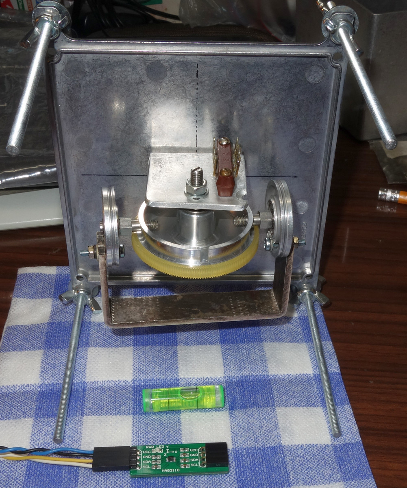
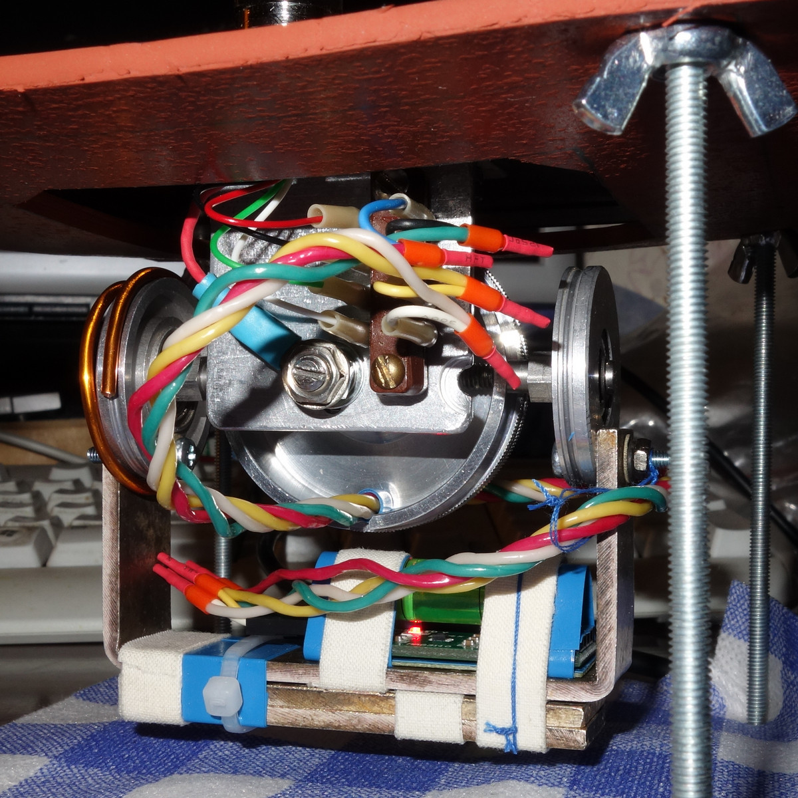
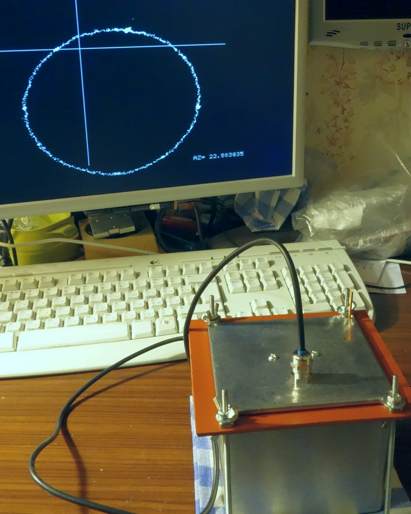
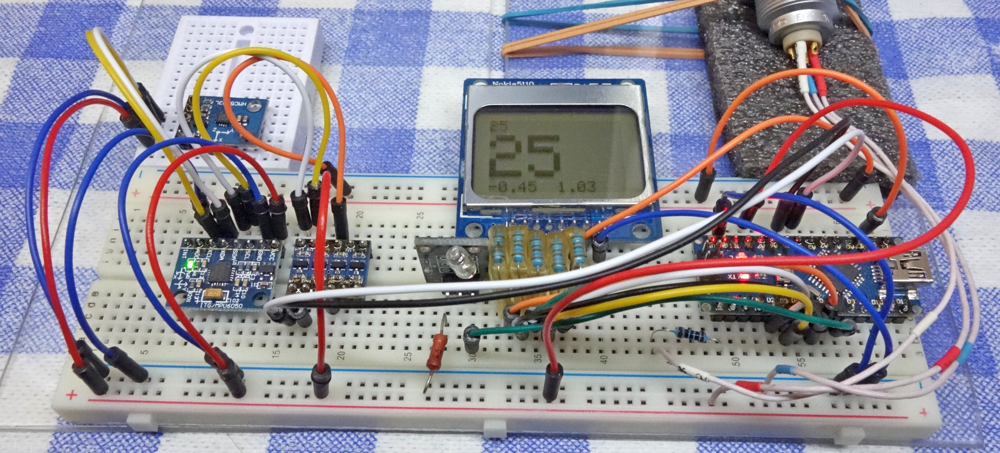
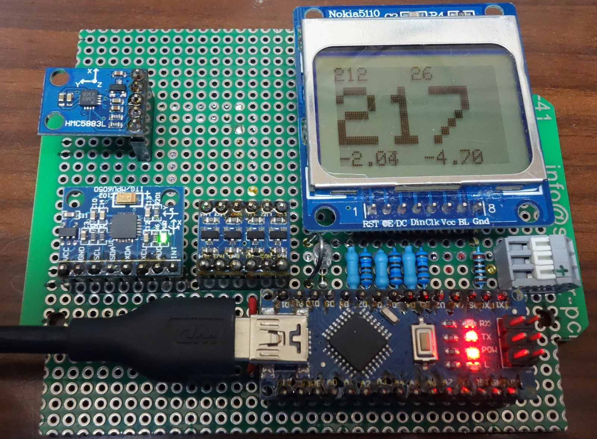
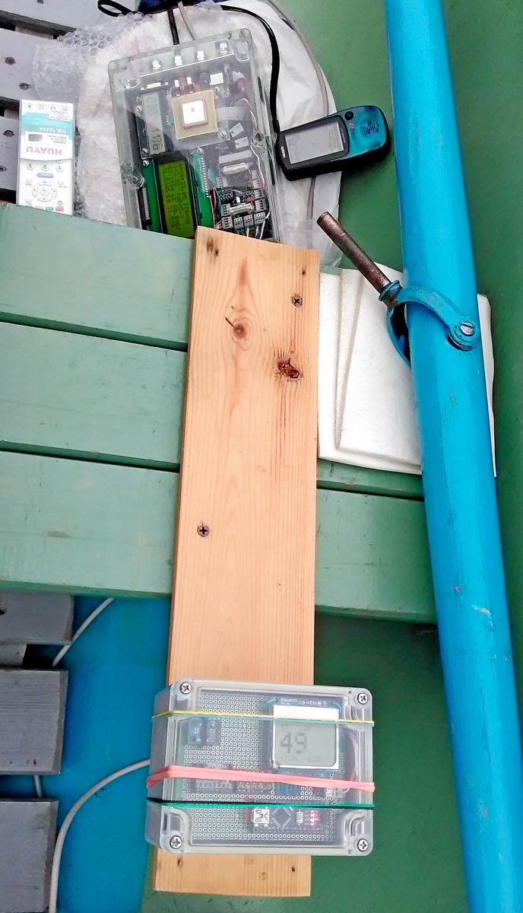

# -Tilt_compensated_compass_ATmega328P
     for boat autopilot (see <https://github.com/Aleksk1/Boat_autopilot_MMBasic>)
________________________________________________________________________________

 Основой многих автопилотов являетя компас. 
Как правило на подвижных транспортных средствах компас сделан так, что показывает правильный азимут не зависимо от наклона.
На лодах, и особенно  парусных яхтах, это важно, т.к. парусная лодка часто идет со значительным креном.
 Компас будем строить на  датчиках, трехосном магнитометре HMC5883L и трехосном акселерометре MPU6050.
В идеальном случае, когда  идеальный магнитометер расположен строго горизонтально, то при вращении в этой плоскости, вектор магнитных компонент (X,Y)  в прямоугольной системе координат, нарисует окружность. При отклонении от горизонтальной плоскости , окружность будет искажаться. Ситуация будет тем хуже чем дальше мы находимся от экватора (в высоких широтах линии магнитного поля входят в поверхность Земли под большими углами, в то время как на экваторе линии параллелны плоскости горизонта).  При этом центр окружности будет смещаться от начала координат. Все это приводит к недопустимым погрешностям определения азимута.
 Раньше с этим боролись, помещая магнитометр в карданов подвес, именно с ним я отходил первый сезон на автопилоте.
У такого устройства довольно много недостатков,
1.  - громоздскость, тяжесть и сложность механической конструкции подвеса, включая проблему упругости проводов и балансировку.
2.  - собственные колебания с высокой добротностью, которые надо гасить.
3.  - демпфироание осуществлялось силиконовым маслом, поэтому нужен дорогой абсолютно герметичный корпус из цветного металла, который мне найти не удалось.
4.  - был выбран неудачный магнитометр с сильными шумами и большим температурным дрейфом.

 

Поэтому было принято решение сделать чисто электронный вариант на более подходящем магнитометре без подвижных элементов конструкции.
Конечно, можно было бы купить готовый модуль компенсированного компаса типа CMPS10 или GY-953, но мне интереснее сделать самому. 
Магнитометр HMC5883L при испытаниях на прорисовку окружности показал себя практически идеально. Оставленный на сутки в работе вектор на эране не сместился ни на один пиксел. Прогрев промышленным феном до 70...80 градусов Цельсия то-же показал отличный результат, смещение оказалось едва заметным. 

Акселерометр MPU6050 для определения вектора силы притяжения показал себя хорошо. Особенно приятно, что производитель калибрует акселерометр на заводе, поэтому его не будем дополнительно калибровать. Для него есть много библиотек. После изучения рада самодельных конструкций остановился на библиотеках для Ардуино под эти датчики , сделанные поляком Korneliusz Jarzebski. У него есть сайт и видеоуроки, где он подробно показал как работрать с этими датчиками, при изготовлении компенсированного компаса.

Вот мой компасс на макетке -

А это готовая плата пока без корпуса -

Я для своих целей существенно доработал тестовую программу, подключил LCD, сделал самокалибровку, исправил досадную ошибку калибровки магнитометра, организовал два низкочатотных фильтра - один включается внутри MPU6050, другой сделан в программе (фильтр Кальмана не удалось толком настроить, он самовозбудился через час работы. Комплементарный, Маджвика или Махони так же усложнит программу и её настройку, пока я не вижу смысла их применять. НЧ фильтр хорошо работает на лодке).

Люди, которые делали компас по данному скетчу, заметили, что компесация работает не по всем сторонам равномерно. Я это тоже заметил.
Дело в том, что Korneliusz Jarzebski калибрует магнитометр только по осям X и Y, в то время как компенсационная формула содерижит кроме магнитных компонет X,Y ещё и  компоненту Z. Эта компонента так же имеет случайное смещение от нуля, и чем больше смещение тем больше врёт компас.

      // Tilt compensation
      Xh = (mag.XAxis-offX) * cosPitch + (mag.ZAxis-offZ) * sinPitch;
      Yh = (mag.XAxis-offX) * sinRoll * sinPitch + (mag.YAxis-offY) * cosRoll - (mag.ZAxis-offZ) * sinRoll * cosPitch;

Поэтому кроме калибровки по X,Y я ввел калибровку по компоненте Z.

## Калибровка компаса в моей программе :

0. Предполагается, что плата находится в прямоугольном корпусе и установлена практически идеально (параллельно плоскостям нижней и верхней части). 
1. После включения питания надо очень точно выставить плоскость низа корпуса ( а значит и платы с датчиками) параллельно горизонтальной плоскости Земли. Для этого в нижней части экрана LCD есть две горизонтальные компоненты от акселерометра. Выравниваем подставку для корпуса, пока они не станут меньше 0.5 градуса каждая. 
2. Выключаем компас и переворачиваем его вверх ногами (помним, что верхняя и нижняя поверхности корпуса строго параллельны).
3. Включаем компас и считаем до десяти. Ртутный выключатель запускает процесс калибровки. В первые 15 секунд загружается программа и происходит запись -Z компоненты магнитного поля. 
4. Полсле отчета десяти, быстро переворачиваем компас и по истечении 15 секунд (с момента включения) происходит запись +Z компоненты и вычисление смещения по формуле offZ = (maxZ + minZ)/2. Если компоненты равны по модулю то оффсет будет нулевым, но это маловероятно.
5. У нас осталось 100-15=85 секунд чтобы плавно повернуть компас в горизонтальной плоскости. Делаем это без рывков плавно, надо успеть до окончания счетчика.
6. Счетчик отсчитал 100 секунд с момента подачи питания. Теперь все три оффсета записаны в EEPROM. Компас откалиброван. Главное, при включении питания компас не ложить на бок и не переворачивать,  иначе калибровка будет уничтожена.

## Демонстрация работы компаса.

## Формат данных на выходе UART компаса.

    Serial.print("$");  //символ начала сообщения. Нужен для парсера в автопилоте.
    Serial.print(Xh);   //компенсированная компонента X
    Serial.print(",");  //разделитель для парсера
    Serial.print(Yh);   //компенсированная компонента Y
    Serial.print(",");  //разделитель для парсера
    Serial.println(floor(Xh)+floor(Yh)); //контрольная сумма  полюс скрытый символ перевода строки LF

## Про магнитное склонение.

На LCD экран самого компаса выводится азимут с учетом магнитного склонения Санкт-Петербурга.
На UART поступают данные без учета магнитного склонения (в автопилоте происходит коррекция). 

## Монтажная схема компаса в формате pdf c разметочной сеткой и без неё.

<https://github.com/Aleksk1/-Tilt_compensated_compass_ATmega328P/blob/master/Schemes/Compass4_no_grid.pdf>
<https://github.com/Aleksk1/-Tilt_compensated_compass_ATmega328P/blob/master/Schemes/Compass4_add_grid.pdf>

_____________________________
## Расположение компаса в лодке.
